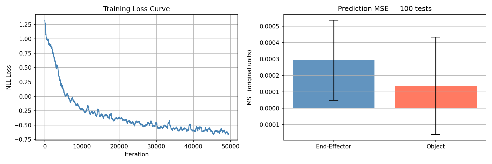
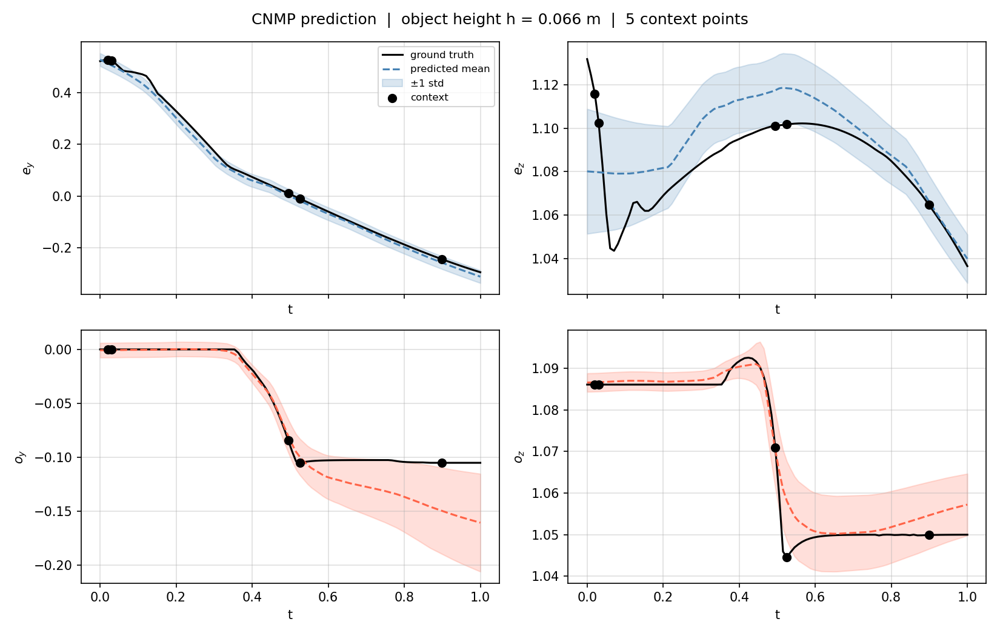

# CMPE591 — Homework 4: Conditional Neural Movement Primitive (CNMP)

## Model

| Component | Details |
|-----------|---------|
| Encoder input | `(t, eᵧ, e_z, oᵧ, o_z)` — 5 dims |
| Aggregation | Mean pooling over context points |
| Decoder input | `(r, t, h)` — conditioned on object height |
| Decoder output | Mean + std for `(eᵧ, e_z, oᵧ, o_z)` |
| Hidden size | 128, 3 layers |
| Loss | Negative log-likelihood (Gaussian) |

## Training

- 200 demonstrations, 80/20 train/test split
- 50 000 iterations, Adam lr=1e-4
- Random context (1–10) and target (1–20) points per iteration

## Deliverables

### Training Loss Curve + MSE Bar Plot



The bar plot shows mean ± std MSE over 100 test episodes with randomly sampled context and query sets. End-effector and object positions are evaluated separately in original (un-normalised) units.

### Test Visualisation



Predicted trajectories (dashed) with ±1 std bands vs. ground truth (solid) for all four output dimensions, given 5 random context points (dots).

## Usage

```bash
# Collect data + train + evaluate
python src/hw4.py

# Visualise learned model (n_ctx optional, default 5)
python src/hw4.py test
python src/hw4.py test 3
```
